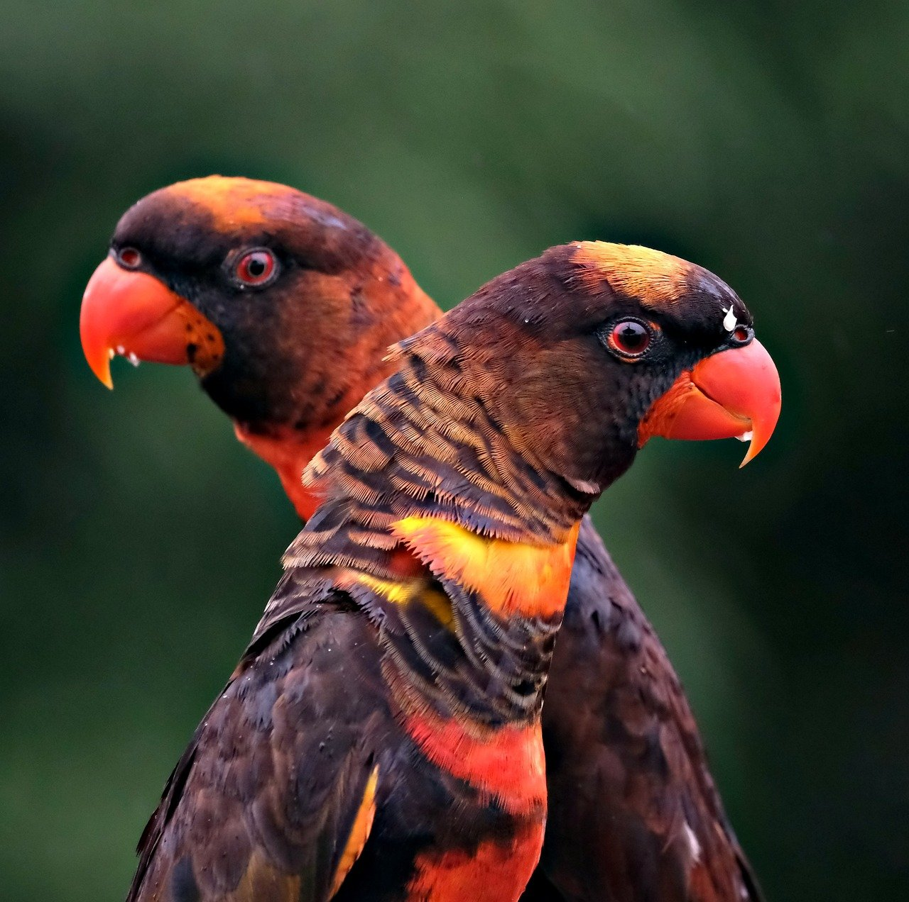
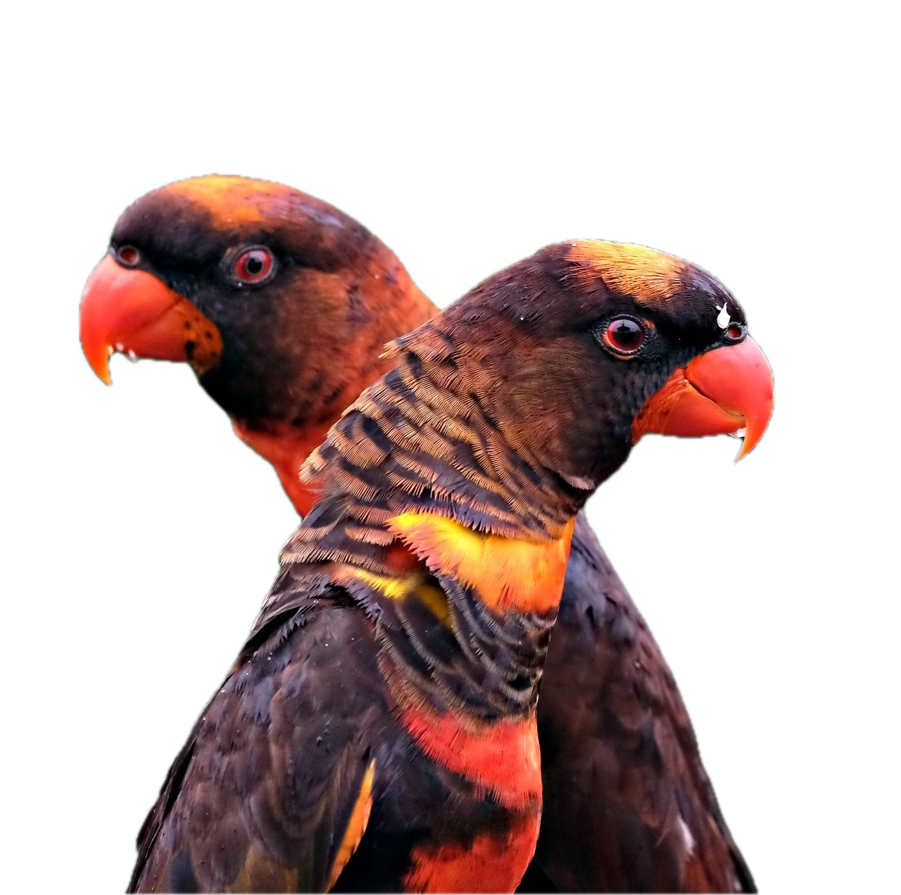
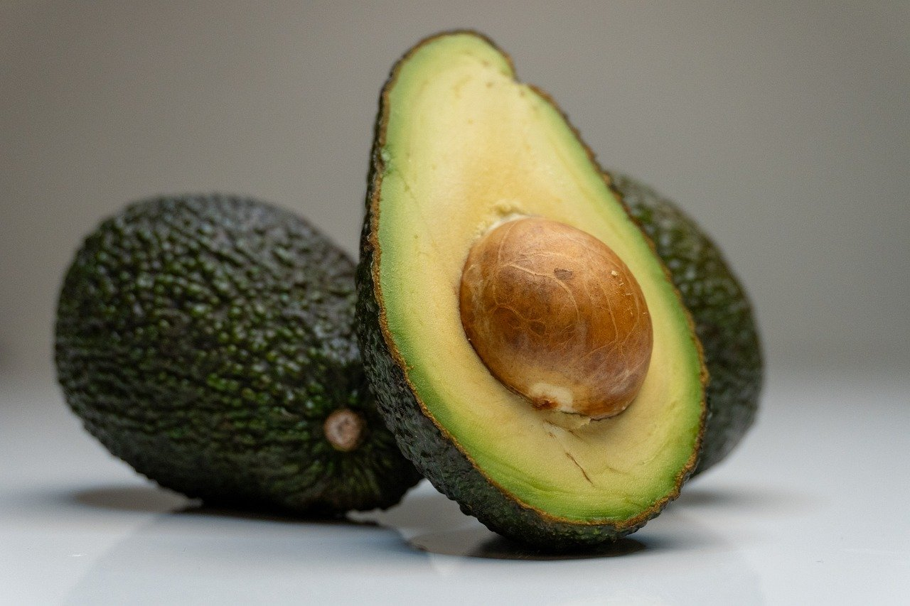
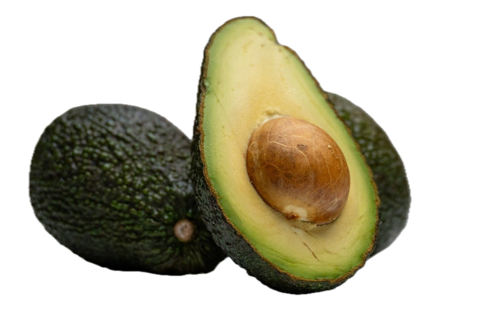

# 鲜艺抠图工具 (xykt)

一个使用 Apple Vision 框架进行图片主体提取（背景移除）的命令行工具，支持单张图片处理和批量处理，它是[鲜艺AI Plus](https://ai.94xy.com)的内置功能之一。

## 功能特性

- 使用 Apple Vision 框架进行智能主体提取
- 支持单张图片处理
- 支持批量处理文件夹中的图片
- 可自定义背景颜色（默认透明）
- 跨平台支持（需要 macOS 14.0+）

## 系统要求

- macOS 14.0+（Apple Vision 主体提取功能需要此版本）
- Swift 5.0+

## 安装

### 方法一：从 GitHub Release 下载（推荐）

1. 访问项目的 GitHub Release 页面
2. 下载适合您系统架构的 zip 包（`xykt-arm64.zip` 或 `xykt-x86_64.zip`）
3. 解压下载的 zip 包
4. 打开解压后的文件夹
5. 双击运行 `install.sh` 脚本进行安装（可能需要输入管理员密码）

### 方法二：从源码编译

1. 克隆或下载本项目到本地
2. 编译 Swift 代码：

```bash
swiftc -o xykt xykt.swift -framework Foundation -framework AppKit -framework CoreImage -framework CoreGraphics -framework Vision
```

3. 运行安装脚本：

```bash
chmod +x install.sh
./install.sh
```

## 卸载

如果您需要卸载鲜艺抠图工具，请按照以下步骤操作：

1. 删除已安装的可执行文件：

```bash
sudo rm /usr/local/bin/xykt
```

2. （可选）如果您在安装时创建了符号链接，也可以检查并删除：

```bash
# 检查是否存在符号链接
ls -la /usr/local/bin/xykt

# 如果存在，删除符号链接
sudo rm /usr/local/bin/xykt
```

卸载完成后，您可以运行 `which xykt` 命令验证是否已成功卸载。如果命令返回空或提示"not found"，则表示卸载成功。

## 使用方法

### 检查 Vision 框架可用性

```bash
xykt -c
```

如果返回 `true`，表示您的系统支持 Apple Vision 主体提取功能。

### 处理单个图片

```bash
xykt -e <输入路径> [输出路径] [-bg <R,G,B>]
```

- `<输入路径>`: 输入图片的路径
- `[输出路径]`: 可选，输出图片的路径，默认为在原文件名后添加 "\_out"
- `[-bg <R,G,B>]`: 可选，设置背景颜色，格式为 "R,G,B"（0-255），默认为透明

**示例：**

```bash
# 处理单个图片并保存为新文件
xykt -e input.jpg output.png

# 处理单个图片并设置白色背景
xykt -e input.jpg -bg 255,255,255
```

### 批量处理文件夹

```bash
xykt -b <输入文件夹> [输出文件夹] [-bg <R,G,B>]
```

- `<输入文件夹>`: 输入图片所在的文件夹路径
- `[输出文件夹]`: 可选，输出图片的文件夹路径，默认为输入文件夹
- `[-bg <R,G,B>]`: 可选，设置背景颜色，格式为 "R,G,B"（0-255），默认为透明

**示例：**

```bash
# 批量处理文件夹中的图片
xykt -b input_folder output_folder

# 批量处理并设置蓝色背景
xykt -b input_folder -bg 0,0,255
```

### 查看帮助信息

```bash
xykt -h
```

## 支持的图片格式

- JPG/JPEG
- PNG
- GIF
- TIFF
- BMP

## 示例

项目根目录下的 `examples` 文件夹包含了一些示例图片和处理后的结果，您可以参考这些示例了解工具的效果。

### 效果对比

|          原图           |            抠图后             |
| :---------------------: | :---------------------------: |
|  |  |
|  |  |
|  |  |

## 技术实现

- 使用 Apple Vision 框架的 `VNGenerateForegroundInstanceMaskRequest` 进行主体提取
- 使用 Core Image 进行图像处理和蒙版应用
- 命令行界面使用 Swift 标准库实现

## 错误处理

工具会返回以下错误信息：

- `无效的图片格式`: 输入文件不是支持的图片格式
- `背景移除失败`: 主体提取过程失败
- `保存文件失败`: 无法保存处理后的图片
- `需要 macOS 14.0+ 版本`: 系统版本不支持 Apple Vision 主体提取
- `无效的参数`: 命令行参数错误
- `无法访问文件夹`: 无法读取输入文件夹
- `无法创建输出目录`: 无法创建输出文件夹
